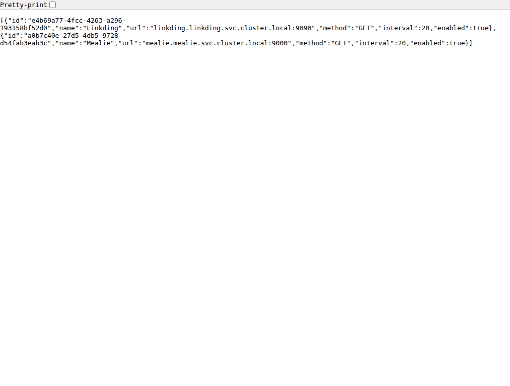
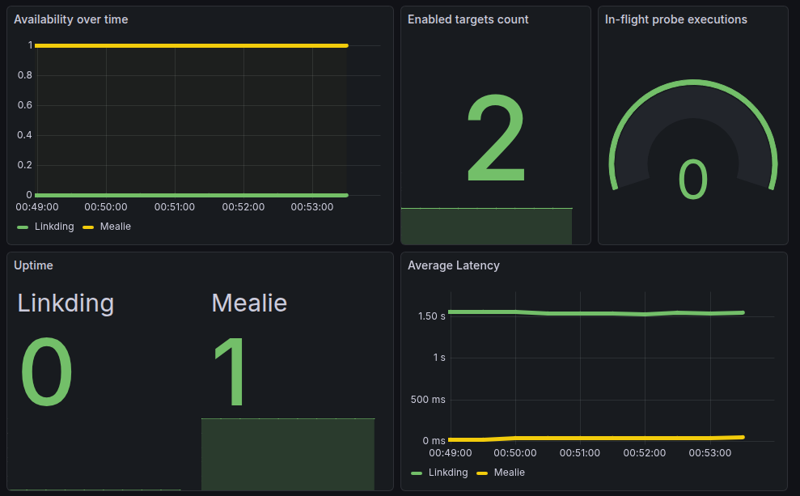
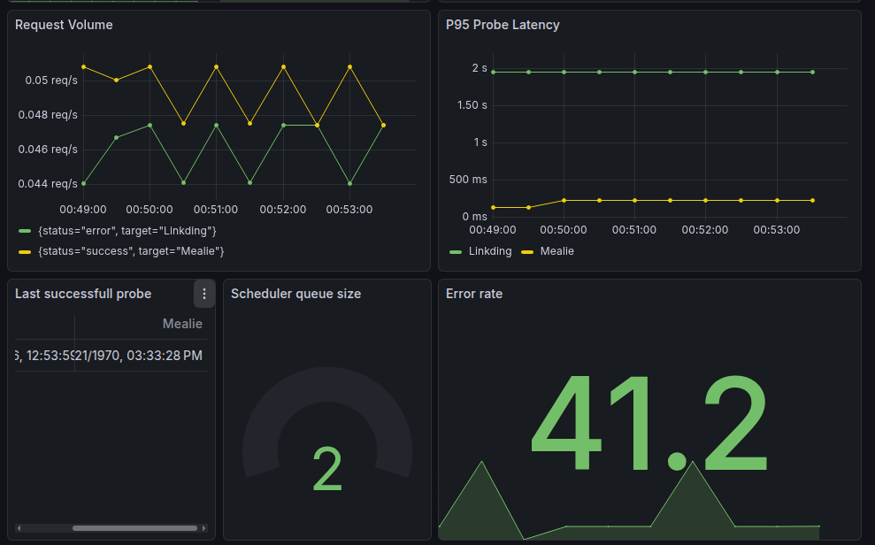

# API Health Monitor (Go + Kubernetes)

A lightweight API health monitor written in Go, with scheduling, metrics and observability (Prometheus + Grafana).

## Overview
This service allows registering API endpoints, periodically probing them, and exposing metrics for monitoring.

Key features:
- Concurrent probe execution with scheduler + worker pool pattern
- Database persistence (Currently used SQLite, but with the repository pattern, any other DBMS can be easily used)
- Prometheus metrics
- Grafana dashboards
- Kubernetes deployment

## Architecture
```mermaid
  flowchart LR

  User --> API[monitor-api (Go)]
  API --> DB[(SQLite)]
  API --> Scheduler
  Scheduler --> Workers
  Workers --> External[External APIs]

  API --> Metrics[/metrics/]
  Metrics --> Prometheus
  Prometheus --> Grafana
```

### Features
- Target CRUD
- Priority-based scheduler
- Worker pool
- Retry + timeout handling
- Metrics export
- Kubernetes-ready

## Run locally

### Prerequisites
- Go (matching `go.mod`)
- Make

### Start
```bash
make run
```

By default the app listens on `:8080` and uses `monitor.db` in the current working directory.

## Run with Docker

```bash
make docker-build
make docker-run
```

Detached mode and stop:

```bash
make docker-run-detached
make docker-stop
```

## Deploy to k3s (local image workflow)

The Kubernetes deployment uses:
- `image: monitor-api:dev`
- `imagePullPolicy: Never`

So images are not pulled from a registry. Instead, build locally and import into k3s containerd.

### One command
```bash
make k3s-deploy
```

### What it does
- `make k3s-build`: builds `monitor-api:dev`, saves tar, imports into k3s
- `make k8s-apply`: applies all manifests under `deployments/k8s/`
- `make k3s-rollout`: restarts deployment and waits for rollout

## Environment variables

| Variable | Default | Description |
|---|---|---|
| `ADDR` | `:8080` | HTTP server bind address |
| `DB_PATH` | `./data/monitor.db` | SQLite database file path |

Kubernetes currently sets `DB_PATH=/data/monitor.db` via deployment env.
Schema migrations are applied automatically on startup.

## Endpoints

### Operational
- `GET /` - basic OK response
- `GET /healthz` - liveness probe
- `GET /readyz` - readiness probe
- `GET /metrics` - Prometheus metrics

### API (`/v1`)
- `GET /v1/status`
- `GET /v1/targets`
- `GET /v1/targets/{id}`
- `GET /v1/targets/{id}/checks`
- `POST /v1/targets`
- `PATCH /v1/targets`
- `DELETE /v1/targets/{id}`

## Access in k3s

Ingress host is `monitor.local` (Traefik).

Example:
```bash
curl -i http://monitor.local/v1/targets
```

If needed, map it in `/etc/hosts` to your k3s node IP.

## Screenshots

### Targets API

Current targets exposed by the k3s ingress:



### Grafana Dashboard

Current k3s dashboard view showing real probe results for Mealie and Linkding:




## Logs and debugging

Deployment logs:

```bash
sudo k3s kubectl logs -n pulse-check deploy/monitor-api
sudo k3s kubectl logs -n pulse-check deploy/monitor-api -f
sudo k3s kubectl logs -n pulse-check deploy/monitor-api --tail=200
sudo k3s kubectl logs -n pulse-check deploy/monitor-api --previous
```

Pod and rollout state:

```bash
sudo k3s kubectl get pods -n pulse-check -l app=monitor-api -o wide
sudo k3s kubectl rollout status deployment/monitor-api -n pulse-check
sudo k3s kubectl describe deploy -n pulse-check monitor-api
```

## Prometheus and Grafana

ServiceMonitor is in namespace `monitoring` and uses label `release: prometheus-stack`.

Port-forward access:

```bash
# Prometheus
sudo k3s kubectl port-forward svc/prometheus-stack-kube-prom-prometheus -n monitoring 9090:9090

# Grafana
sudo k3s kubectl port-forward svc/prometheus-stack-grafana -n monitoring 3000:80
```

Then open:
- Prometheus: `http://localhost:9090`
- Grafana: `http://localhost:3000`

## Metrics

- `probe_requests_total`
- `probe_latency_ms`
- `probe_up`
- `probe_last_success_timestamp`
- `scheduler_queue_size`
- `probe_runs_in_flight`


Create one target quickly:

```bash
curl -i -X POST http://monitor.local/v1/targets \
  -H "Content-Type: application/json" \
  -d '{"name":"Example","url":"https://example.com","method":"GET","interval":10}'
```

Then query in Prometheus:
- `probe_up`
- `probe_requests_total`
- `probe_latency_ms_count`

## API examples

```bash
# health and readiness
curl -i http://monitor.local/healthz
curl -i http://monitor.local/readyz

# list targets
curl -s http://monitor.local/v1/targets

# get one target
curl -s http://monitor.local/v1/targets/<target-id>

# get checks for target
curl -s http://monitor.local/v1/targets/<target-id>/checks

# update target
curl -i -X PATCH http://monitor.local/v1/targets \
  -H "Content-Type: application/json" \
  -d '{"id":"<target-id>","name":"Updated","url":"https://example.com","method":"GET","interval":60,"enabled":true}'

# delete target
curl -i -X DELETE http://monitor.local/v1/targets/<target-id>
```
